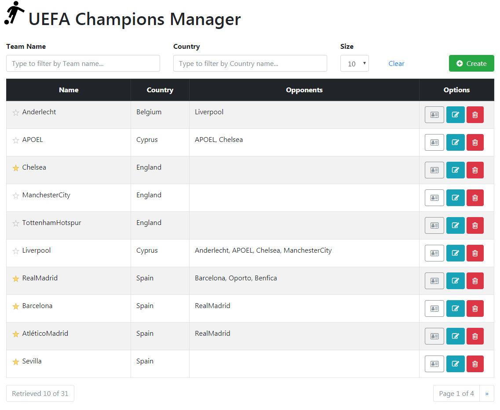
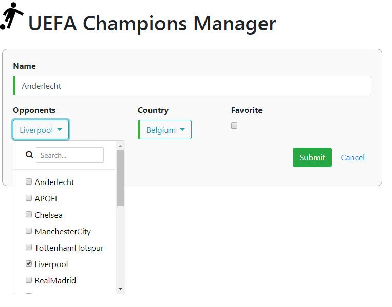
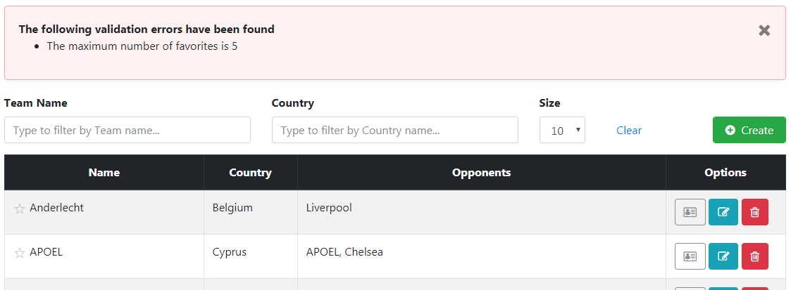

# UEFA Champions Manager frontend

This project is the frontend of the **UEFA Champions Manager** application implemented with Angular 4.4.6. 

## Running the application (development server)

**Install dependencies**
```
npm install
```

**Launch development server**
```
npm start 
```
Navigate to [http://localhost:4200/](http://localhost:4200/). 

The app will automatically reload if you change any of the source files.

The file `proxy.conf.json` has been configured to stablish a proxy to the default backend host and port (http://localhost:8080) in order to avoid cross-domain issues during the development.

**Execute unit test**
```
npm test 
```

## Project structure

There are two modules in the application, the root module `app.module` and the `core.module`. If another feature were added  to the app, it would be needed to add one `NgModule` for all distinct features in an application.

We can find two main folders in the application, which are called core and teams.

### 1. core
This folder has the `CoreModel`. In `CoreModule` are included single use components and singleton services whose instance will be shared throughout the application. Contents:

* `ErrorMessageComponent`: this component is used to display the server error messages.
* `ErrorModel`:  Model for the exception handler.
* `ErrorService`: Service to handle errors.

### 2. teams

This folder contains the unique feature of the application, with the following content:

* `TeamDetailComponent`: its main functionality is displaying the detail of an specific Team. It is possible select the team as favorite (using FavoriteComponent) and go to edit screen.

* `TeamFormComponent`: Component to edit/create a Team using a template-driven form. The validations are added as validation attributes.

* `TeamListComponent`: Component to list all the Teams using a paginated table. The user can:
  - filter the teams by name and country. For retrieving the filtered Teams a `debounceTime` is used in order to wait a short time after every keystroke
  - check a Team as favorite, using `TeamFavoriteComponent`
  - remove a team
  - go to edit or create screen

* `shared` folder:  This folder includes contents referenced across several components inside teams feature:
  - `PaginatedModel`: Models to define the structures uses in the pagination of the table.
  - `TeamFavoriteComponent`: Component to check a Team as favorite. This is distributed under shared folder because it's being used from several parts of the application.
  - `CountryModel`: Model for the countries
  - `TeamModel`: Model for a Team
  - `TeamService`: Business logic and communication with the backend.


There are some other functionalities that are candidates to be implemented by using a reusable component like:
  -  Search Filter component
  -  Pagination size component
  -  Table result component (sorting, column reordening, etc)

For the sake of simplicity, we chose not to create a component for them. One example of reusable component can be found at `TeamFavoriteComponent` used from the list of teams and team detail feature.

Also, some functionality improvement should have been implemented like the keep the last search in the **Local storage** in order to go back to the previous state after editing or creating a team.

# Screenshots

### Team search (inital screen)


### Team edit


### Error handling

